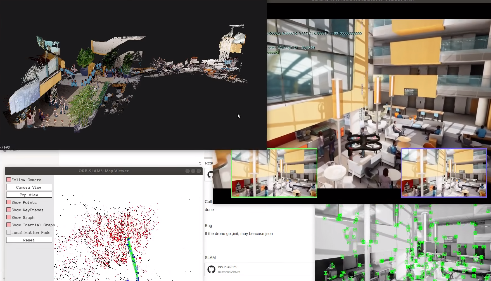

# Exploration With Airsim




本项目在 Ubuntu20.04， ROS-noetic, Airsim 1.7.0-Linux 下通过测试:

## 一、先决条件
```shell
# 下载项目
cd ~ && git clone https://github.com/Derkai52/Exploration_With_Airsim.git

# 安装依赖项
apt-get install gcc-8 g++-8

# 编译 Airsim
cd Exploration_With_Airsim
./setup.sh
./build.sh

# 构建 ROS 接口
cd ros
catkin build -DCMAKE_C_COMPILER=gcc-8 -DCMAKE_CXX_COMPILER=g++-8
```
## 二、ROS 配置

ROS noetic 安装请参考：https://wiki.ros.org/noetic/Installation/Ubuntu

```shell
# 这里以 noetic 为例，还需要额外安装以下包：
sudo apt-get install -y python3-catkin-tools ros-noetic-mavros* ros-noetic-tf2-sensor-msgs

# sophus 配置
sudo apt-get install ros-noetic-sophus

# octomap 配置
sudo apt-get install ros-noetic-octomap ros-noetic-octomap-mapping ros-noetic-octomap-msgs ros-noetic-octomap-ros ros-noetic-octomap-rviz-plugins ros-noetic-octomap-server
```

## 二、ORB_SLAM_Dense_Map 配置
### Ponglin
```shell
# 安装依赖项
sudo apt-get install libglew-dev
sudo apt-get install libpython2.7-dev
sudo apt-get install libxkbcommon-dev
sudo apt-get install wayland-protocols

# 编译Ponglin
git clone https://github.com/stevenlovegrove/Pangolin.git
cd Pangolin && mkdir build && cd build

cmake ..

make

sudo make install
```
### Eigen3
```shell
sudo apt-get install libeigen3-dev
```

### OpenCV 4.2.0
```shell
# 安装依赖项
sudo apt-get install build-essential
sudo apt-get install cmake git libgtk2.0-dev pkg-config libavcodec-dev libavformat-dev libswscale-dev

# 下载 opencv 和 opencv_contrib
git clone -b 4.2.0 https://github.com/opencv/opencv.git
cd opencv
git clone -b 4.2.0 https://github.com/opencv/opencv_contrib.git

# 编译
cd ../ && mkdir build && cd build
cmake -D CMAKE_BUILD_TYPE=Release -DOPENCV_GENERATE_PKGCONFIG=ON -D CMAKE_INSTALL_PREFIX=/usr/local -DOPENCV_EXTRA_MODULES_PATH=/home/${USER}/opencv/opencv_contrib/modules /home/${USER}/opencv/ ..

make

sudo make install
```

### PCL 1.12.0
```shell
# 下载 pcl
git clone -b pcl-1.12.0 https://github.com/PointCloudLibrary/pcl.git

# 编译
cd pcl && mkdir build && cd build

cmake ..

make 

sudo make install
```
### 编译 ORB_SLAM
```shell
# 设置环境变量
export ROS_PACKAGE_PATH=${ROS_PACKAGE_PATH}:/home/${USER}/Exploration_With_Airsim/ORB_SLAM3_dense_map/Examples/ROS

cd Exploration_With_Airsim/ORB_SLAM3_dense_map

./build_ros.sh
```

## 三、下载场景包
```shell
# 下载和解压
wget -c https://github.com/microsoft/AirSim/releases/download/v1.7.0-linux/Blocks.zip

unzip Blocks.zip

# 启动场景
cd Blocks/LinuxNoEditor/
./Blocks.sh -ResX=1080 -ResY=720 -windowed
```


## 四、Docker 部署
```shell
# 进入docker目录并构建镜像
cd docker 

# 构建镜像
python3 build_airsim_image.py --base_image=nvidia/cudagl:10.0-base-ubuntu18.04 --target_image=airsim_binary:10.0-base-ubuntu18.04

# 创建容器
docker run -it --gpus all --net=host --name=airsim --env="DISPLAY=$DISPLAY" -v /usr/share/vulkan/icd.d:/usr/share/vulkan/icd.d --env="QT_X11_NO_MITSHM=1" --volume="/tmp/.X11-unix:/tmp/.X11-unix:rw" -e SDL_VIDEODRIVER=$SDL_VIDEODRIVER_VALUE -e SDL_HINT_CUDA_DEVICE='0' airsim_binary:10.0-base-ubuntu18.04 /bin/bash
```

## 五、使用
```shell
cd Exploration_With_Airsim/ORB_SLAM3_dense_map
source devel/setup.bash

# 启动 airsim 节点
roslaunch airsim_ros_pkgs airsim_node.launch

# 启动 rviz 可视化工具
roslaunch airsim_ros_pkgs rviz.launch

# 启动建图节点
roslaunch drone_exploration octomap.launch

# 使用按键控制飞行
python3 Exploration_With_Airsim/ros/src/drone_exploration/scripts/main_keyboard_control.py

# （可选）使用手柄控制
roslaunch drone_exploration uav_joy.launch
```

## 致谢
本项目参考 https://github.com/shuaikangma/DRL_Exploration_With_Airsim.git
